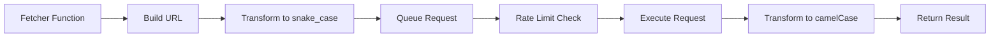

## Overview

DiscordKit uses a consistent request handler pattern called `Fetcher` to interact with Discord's API. Each API endpoint has a corresponding fetcher function that handles request formatting, validation, and response parsing.

## The Fetcher Type

The `Fetcher` type is the foundation of DiscordKit's request handling:

```typescript
type Fetcher<
  /** A schema to validate the input arguments of a fetch call */
  S extends GenericSchema | GenericSchemaAsync | null = null,
  /** The return value expected from the fetch call */
  R = void
> = S extends null
  ? () => Promise<R>
  : (config: InferOutput<NonNullable<S>>) => Promise<R>;
```

Source: `/home/daytona/workspace/source/packages/core/src/requests/methods.ts:7`

## HTTP Methods

DiscordKit provides type-safe wrappers for all HTTP methods:

<Tabs>
  <Tab title="GET">
    ```typescript
    import { get } from '@discordkit/core';

    // Fetch a resource
    const data = await get<ApplicationCommand[]>(
      `/applications/${applicationId}/commands`,
      { withLocalizations: true }
    );
    ```
  </Tab>

  <Tab title="POST">
    ```typescript
    import { post } from '@discordkit/core';

    // Create a resource
    const webhook = await post<Webhook>(
      `/channels/${channelId}/webhooks`,
      { name: 'My Webhook', avatar: avatarUrl }
    );
    ```
  </Tab>

  <Tab title="PATCH">
    ```typescript
    import { patch } from '@discordkit/core';

    // Update a resource
    const updated = await patch<Message>(
      `/channels/${channelId}/messages/${messageId}`,
      { content: 'Updated content' }
    );
    ```
  </Tab>

  <Tab title="DELETE">
    ```typescript
    import { remove } from '@discordkit/core';

    // Delete a resource
    await remove(`/channels/${channelId}/messages/${messageId}`);
    ```
  </Tab>
</Tabs>

Source: `/home/daytona/workspace/source/packages/core/src/requests/methods.ts:16`

## Request Flow

Every request in DiscordKit follows this flow:



### 1. URL Building

URLs are constructed with the Discord API endpoint:

```typescript
import { buildURL } from '@discordkit/core';

// Build URL with query parameters
const url = buildURL('/applications/123/commands', {
  withLocalizations: true
});
// Result: https://discord.com/api/v10/applications/123/commands?with_localizations=true
```

Source: `/home/daytona/workspace/source/packages/core/src/requests/buildURL.ts:1`

### 2. Case Transformation

DiscordKit automatically converts between camelCase (JavaScript) and snake_case (Discord API):

```typescript
import { request } from '@discordkit/core';

// Input (camelCase)
const body = {
  guildId: '123',
  maxUses: 10,
  createdAt: new Date()
};

// Sent to Discord (snake_case)
// {
//   "guild_id": "123",
//   "max_uses": 10,
//   "created_at": "2026-03-01T..."
// }

// Response (converted back to camelCase)
const result = await request(url, 'POST', body);
```

Source: `/home/daytona/workspace/source/packages/core/src/requests/request.ts:18`

### 3. Rate Limiting & Queueing

All requests are automatically queued and rate-limited:

```typescript
// Multiple requests are automatically queued
const [user1, user2, user3] = await Promise.all([
  getUser({ user: '123' }),
  getUser({ user: '456' }),
  getUser({ user: '789' })
]);

// DiscordKit handles:
// - Global rate limit (50 req/s)
// - Per-route rate limits
// - Automatic retries on 429
// - Invalid request tracking
```

Source: `/home/daytona/workspace/source/packages/core/src/requests/DiscordSession.ts:106`

## Creating Fetcher Functions

Here's how DiscordKit creates fetcher functions for each endpoint:

### Simple Fetcher (No Input)

```typescript
import { get, type Fetcher } from '@discordkit/core';
import { type Application, applicationSchema } from './types';

/**
 * Get Current Application
 * GET /applications/@me
 */
export const getCurrentApplication: Fetcher<null, Application> = 
  async () => get(`/applications/@me`);
```

Source: `/home/daytona/workspace/source/packages/client/src/application/getCurrentApplication.ts:17`

### Fetcher with Input Schema

```typescript
import * as v from 'valibot';
import { get, type Fetcher, snowflake } from '@discordkit/core';
import { type ApplicationCommand, applicationCommandSchema } from './types';

// Define input schema
export const getGlobalApplicationCommandsSchema = v.object({
  application: snowflake,
  params: v.exactOptional(
    v.object({
      withLocalizations: v.nullish(v.boolean())
    })
  )
});

/**
 * Get Global Application Commands
 * GET /applications/:application/commands
 */
export const getGlobalApplicationCommands: Fetcher<
  typeof getGlobalApplicationCommandsSchema,
  ApplicationCommand[]
> = async ({ application, params }) =>
  get(`/applications/${application}/commands`, params);
```

Source: `/home/daytona/workspace/source/packages/client/src/application/getGlobalApplicationCommands.ts:36`

### POST Fetcher with Body

```typescript
import * as v from 'valibot';
import { post, type Fetcher, snowflake, boundedString, url } from '@discordkit/core';
import { type Webhook, webhookSchema } from './types';

// Define input schema
export const createWebhookSchema = v.object({
  channel: snowflake,
  body: v.object({
    name: boundedString({ max: 80 }),
    avatar: url
  })
});

/**
 * Create Webhook
 * POST /channels/:channel/webhooks
 */
export const createWebhook: Fetcher<
  typeof createWebhookSchema,
  Webhook
> = async ({ channel, body }) => 
  post(`/channels/${channel}/webhooks`, body);
```

Source: `/home/daytona/workspace/source/packages/client/src/webhook/createWebhook.ts:39`

## Error Handling

Fetcher functions throw errors for failed requests:

```typescript
import { discord, getCurrentApplication } from '@discordkit/client';

discord.setToken(`Bot ${process.env.BOT_TOKEN}`);

try {
  const app = await getCurrentApplication();
  console.log('Application:', app.name);
} catch (error) {
  // Error: Request to resource 'https://discord.com/api/v10/applications/@me' failed:
  // 401 Unauthorized
  console.error('Failed to get application:', error);
}
```

Source: `/home/daytona/workspace/source/packages/core/src/requests/request.ts:30`

## Advanced Features

### Custom Endpoints

You can customize the API endpoint:

```typescript
import { discord } from '@discordkit/client';

// Use a different API version
discord.endpoint = 'https://discord.com/api/v11/';
```

### Retry Configuration

Configure automatic retry behavior:

```typescript
import { discord } from '@discordkit/client';

// Set max retries for 429 responses
discord.maxRetries = 3; // Default: 5
```

Source: `/home/daytona/workspace/source/packages/core/src/requests/DiscordSession.ts:29`

### Request Queue Monitoring

Monitor the current request queue:

```typescript
import { discord } from '@discordkit/client';

const queueSize = discord.getQueueSize();
console.log(`${queueSize} requests queued`);
```

Source: `/home/daytona/workspace/source/packages/core/src/requests/DiscordSession.ts:339`

## Best Practices

<CardGroup cols={2}>
  <Card title="Use Type Inference" icon="wand-magic-sparkles">
    Let TypeScript infer types from schemas instead of manually typing.
  </Card>
  
  <Card title="Handle Errors" icon="triangle-exclamation">
    Always wrap API calls in try-catch blocks for production code.
  </Card>
  
  <Card title="Batch Requests" icon="layer-group">
    Use `Promise.all()` for independent requests - DiscordKit handles rate limiting.
  </Card>
  
  <Card title="Validate Input" icon="shield-check">
    Use validated fetchers (`*Safe` variants) when working with user input.
  </Card>
</CardGroup>

## Common Patterns

### Parallel Requests

```typescript
import { getGuildMember } from '@discordkit/client';

// Fetch multiple members in parallel
const members = await Promise.all(
  userIds.map(userId => 
    getGuildMember({ guild: guildId, user: userId })
  )
);
```

### Conditional Requests

```typescript
import { getMessage, createMessage } from '@discordkit/client';

// Check if message exists before creating
try {
  const existing = await getMessage({ channel: channelId, message: messageId });
  console.log('Message already exists');
} catch (error) {
  // Message doesn't exist, create it
  await createMessage({
    channel: channelId,
    body: { content: 'New message' }
  });
}
```

### Pagination

```typescript
import { getGuildMembers } from '@discordkit/client';

let after: string | undefined;
const allMembers = [];

do {
  const members = await getGuildMembers({
    guild: guildId,
    params: { limit: 1000, after }
  });
  
  allMembers.push(...members);
  after = members[members.length - 1]?.user.id;
} while (after);
```

## Next Steps

<CardGroup cols={2}>
  <Card title="Validation" icon="check-circle" href="/concepts/validation">
    Learn about schema validation with Valibot
  </Card>
  
  <Card title="Integrations" icon="puzzle-piece" href="/concepts/integrations">
    Explore tRPC and React Query integrations
  </Card>
</CardGroup>